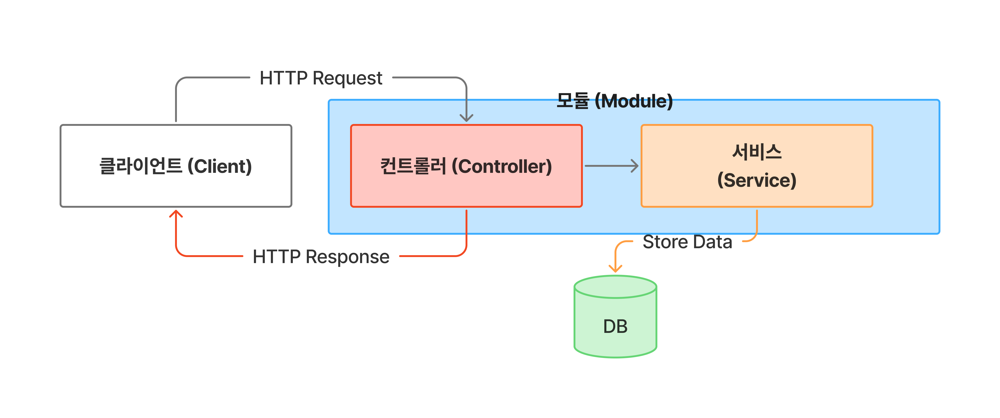

# NestJS 대표 구조 이해

## 0. 참고 링크

* 공식 문서: [https://docs.nestjs.com](https://docs.nestjs.com)
* 공식 예제 GitHub: [https://github.com/nestjs/nest/tree/master/sample](https://github.com/nestjs/nest/tree/master/sample)

---

## 1. 기본 구조 한눈에 보기

NestJS 프로젝트를 생성하면 가장 먼저 다음과 같은 구조를 보게 된다.

```text
src/
├─ main.ts
├─ app.module.ts
├─ app.controller.ts
├─ app.service.ts
```

이 구조는 **NestJS가 의도한 최소 단위 아키텍처**이며, 이후 모든 기능 확장은 이 패턴을 반복하게 된다.

---

## 2. 대표 구조 (확장된 파일 트리 예시)

실제 서비스에서는 보통 기능 단위(Module 단위)로 다음과 같이 구성된다.

```text
src/
├─ main.ts
├─ app.module.ts
│
├─ users/
│  ├─ users.module.ts
│  ├─ users.controller.ts
│  ├─ users.service.ts
│  └─ dto/
│     └─ create-user.dto.ts
│
├─ auth/
│  ├─ auth.module.ts
│  ├─ auth.controller.ts
│  └─ auth.service.ts
│
└─ common/
   ├─ guards/
   ├─ interceptors/
   └─ filters/
```

핵심 포인트는 **기능 = Module** 이라는 점이다.

---

## 3. 구조에 대한 핵심 설명

NestJS는 다음 4가지 개념을 중심으로 동작한다.

* Module (구성 단위)
* Controller (입구)
* Service (비즈니스 로직)
* Provider (DI 대상 객체)

이 모든 것을 **Module이 묶어서 관리**한다.

---

## 4. 전체 구조 흐름 이해



```text
[ Client Request ]
        ↓
[ Controller ]  ← 요청 라우팅, 요청/응답 처리
        ↓
[ Service ]     ← 비즈니스 로직
        ↓
[ Repository / External API / DB ]
```

그리고 이 흐름 전체를 **Module + DI 컨테이너**가 관리한다.

---

## 5. Module (모듈)

### 역할

* 관련된 Controller / Provider(Service)를 묶는 단위
* DI 범위를 정의
* 애플리케이션의 구조 자체

### 예시 (현재 코드: `src/app.module.ts`)

```ts
import { Module } from '@nestjs/common';            // Nest 모듈 데코레이터 제공
import { AppController } from './app.controller';   // 이 모듈에 등록할 컨트롤러
import { AppService } from './app.service';         // 이 모듈에 등록할 프로바이더(서비스)

@Module({ // 모듈 메타데이터 시작
  imports: [],                  // 현재 모듈에서 사용하는 다른 모듈 없음
  controllers: [AppController], // 이 모듈에서 요청을 처리할 컨트롤러
  providers: [AppService],      // 이 모듈에서 주입할 수 있는 프로바이더
}) 

export class AppModule {} // 루트 모듈 선언
```

👉 NestJS에서 **모듈은 설계도**에 가깝다.

---

## 6. Provider (프로바이더)

### 역할

* NestJS DI 컨테이너에 의해 관리되는 객체
* Service, Repository, Factory 등 모두 Provider

### 예시 (현재 코드: `src/app.service.ts`)

```ts
import { Injectable } from '@nestjs/common'; // DI 대상 표시용 데코레이터 제공

@Injectable() // Nest DI 컨테이너가 관리하도록 표시
export class AppService {   // 서비스(프로바이더) 클래스 선언
  getHello(): string {      // 컨트롤러가 호출할 비즈니스 메서드
    return 'Hello World!';  // 실제 응답 문자열
  }
}
```

👉 `@Injectable()`이 붙은 순간 DI 대상이 된다.

---

## 7. Controller (컨트롤러)

### 역할

* HTTP 요청 진입점
* URL, HTTP Method 매핑
* 비즈니스 로직을 직접 수행하지 않음

### 예시 (현재 코드: `src/app.controller.ts`)

```ts
import { Controller, Get } from '@nestjs/common';   // 컨트롤러/라우팅 데코레이터 제공
import { AppService } from './app.service';         // 비즈니스 로직을 가진 서비스

@Controller() // 기본 경로('/')에 매핑되는 컨트롤러
export class AppController { // 컨트롤러 클래스 선언
  constructor(private readonly appService: AppService) {} // DI로 서비스 주입

  @Get() // HTTP GET 요청 매핑
  getHello(): string { // GET / 요청 핸들러
    return this.appService.getHello(); // 서비스의 로직을 호출해 응답 반환
  }
}
```

👉 Controller는 **얇을수록 좋다**.

---

## 8. Service (서비스)

### 역할

* 실제 비즈니스 로직 담당
* 여러 Controller에서 재사용 가능

### 예시 (현재 코드: `src/app.service.ts`)

```ts
import { Injectable } from '@nestjs/common'; // DI 대상 표시용 데코레이터 제공

@Injectable()               // Nest DI 컨테이너가 관리하도록 표시
export class AppService {   // 서비스(프로바이더) 클래스 선언
  getHello(): string {      // 컨트롤러가 호출할 비즈니스 메서드
    return 'Hello World!';  // 실제 응답 문자열
  }
}
```

👉 NestJS의 핵심 로직은 대부분 Service에 위치한다.

---

## 9. 앱 시작점 (부트스트랩)

### 예시 (현재 코드: `src/main.ts`)

```ts
import { NestFactory } from '@nestjs/core'; // Nest 애플리케이션 생성 팩토리
import { AppModule } from './app.module';   // 루트 모듈

async function bootstrap() { // 애플리케이션 시작 함수
  const app = await NestFactory.create(AppModule);  // AppModule 기반으로 앱 생성
  await app.listen(process.env.PORT ?? 3000);       // 환경변수 PORT 또는 3000으로 서버 시작
}
bootstrap(); // 앱 시작 실행
```

?? `main.ts`는 **Nest 애플리케이션의 진입점**이다.

---

## 10. DTO (데이터 전송 객체) 개념

### 역할

* 요청/응답 데이터의 구조를 명확히 정의
* 유효성 검사(Validation Pipe)와 함께 사용하면 안정성 향상

### 예시 (현재 프로젝트에는 없음, 예시로만 소개)

```ts
export class CreateUserDto {    // 사용자 생성 요청 DTO
  name: string;                 // 클라이언트가 보내는 이름 필드
  email: string;                // 클라이언트가 보내는 이메일 필드
}
```

?? 보통 `src/users/dto/` 같은 위치에 둔다.

---

## 11. 의존성 주입 (DI) 요약

### 핵심 개념

* 객체를 직접 생성하지 않음
* NestJS 컨테이너가 생성 & 관리

```ts
constructor(private readonly appService: AppService) {} // 컨테이너가 AppService를 주입
```

### 효과

* 결합도 감소
* 테스트 용이
* 구조적 안정성 확보

---

## 12. 한 문장으로 정리

> NestJS는 **Module을 중심으로 Controller와 Service를 분리하고, 모든 객체를 DI 컨테이너가 관리하는 구조적 프레임워크**이다.

---

## 다음으로 보면 좋은 주제

* Module import / export 전략
* Global Module vs Feature Module
* Request Scope / Singleton Scope
* Express 기반 NestJS 내부 동작 흐름

원하면 이 문서를 기준으로 **확장 템플릿**이나 **Spring과 1:1 대응 구조**로도 정리해줄 수 있다.
